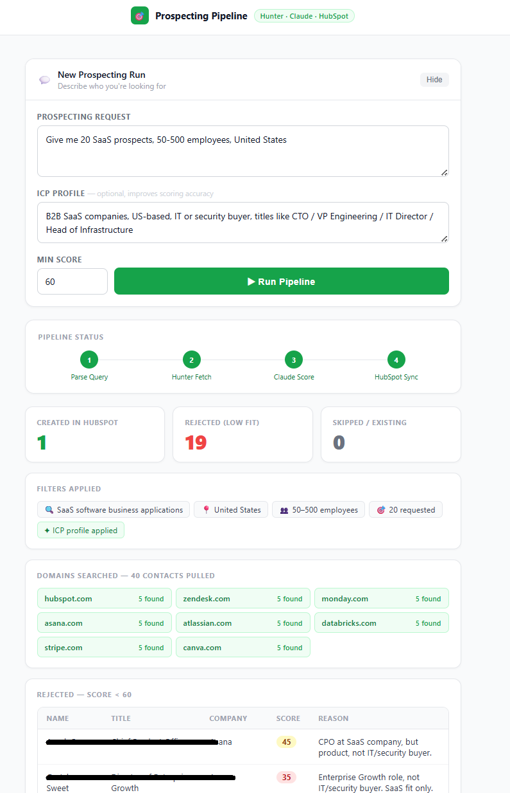
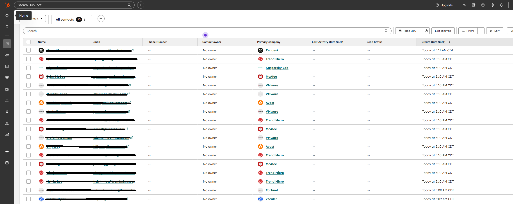

#  AI Prospecting Pipeline

A natural language prospecting tool that finds contacts via Hunter.io, scores them for ICP fit using Claude, and pushes accepted contacts directly into HubSpot.

**Flow:** Type/Speak a request → Hunter fetches contacts → Claude scores fit → HubSpot sync

---

Live link: https://web-production-5dcc.up.railway.app/

---

## Screenshots

### UI — Run a prospect search in plain English



### HubSpot — Contacts created automatically after each run



---

## What It Does

1. You type something like: *"Give me 50 cybersecurity prospects, 50-500 employees, US"*
2. Claude parses it into target company domains and filters
3. Hunter.io fetches real contacts from those domains
4. Claude scores each contact 0–100 against your ICP
5. Contacts above your minimum score get created in HubSpot
6. You see a summary: *"Created 43 contacts + 7 rejected (low fit)"*

---

## Prerequisites

You need API keys for three services:

| Service | What it's used for | Where to get it |
|---|---|---|
| [Hunter.io](https://hunter.io) | Fetching contacts by domain | Dashboard → API |
| [HubSpot](https://hubspot.com) | Creating contacts in your CRM | Settings → Private Apps |
| [Anthropic](https://console.anthropic.com) | Parsing queries + scoring | API Keys |

HubSpot private app needs the `crm.objects.contacts.write` scope.

---

## Running Locally

**1. Clone the repo**
```bash
git clone https://github.com/YOUR_USERNAME/YOUR_REPO.git
cd YOUR_REPO
```

**2. Install dependencies**
```bash
pip install -r requirements.txt
```

**3. Set up your API keys**
```bash
cp .env.example .env
```
Open `.env` and fill in your keys:
```
HUNTER_API_KEY=your_key_here
HUBSPOT_API_KEY=pat-your_token_here
ANTHROPIC_API_KEY=sk-ant-your_key_here
```

**4. Start the server**
```bash
python -m uvicorn main:app --reload --port 8000
```

**5. Open in browser**
```
http://localhost:8000
```

---

## Deploying to Railway (Recommended)

Railway gives you a public URL in ~10 minutes.

1. Push this repo to GitHub
2. Go to [railway.app](https://railway.app) → New Project → Deploy from GitHub
3. Select this repo
4. Go to **Variables** and add your three API keys
5. Go to **Settings → Domains → Generate Domain**

Your app is now live at `https://yourapp.up.railway.app`

---

## Project Structure

```
├── main.py            # FastAPI app + UI
├── query_parser.py    # NL query → filters + target domains (Claude)
├── hunter_client.py   # Fetch contacts from Hunter.io
├── scorer.py          # Score prospects 0-100 (Claude)
├── hubspot_client.py  # Create contacts in HubSpot
├── requirements.txt
├── Procfile           # Railway/Heroku deployment
├── .env.example       # API key template
└── .gitignore
```

---

## Usage Tips

- **ICP Profile field** — fill this in for more accurate scoring. Example: *"B2B SaaS, 50-500 employees, US, security buyer, titles: CISO / VP Security / IT Director"*
- **Min Score** — default is 60. Lower it if too many are being rejected, raise it for stricter filtering.
- **Contacts with no email** — Hunter won't always have emails for every domain. Those are skipped automatically.

---

## API Endpoint

The UI calls this under the hood. You can also call it directly:

```bash
curl -X POST http://localhost:8000/prospect \
  -H "Content-Type: application/json" \
  -d '{
    "query": "Give me 20 fintech prospects, 100-500 employees, US",
    "icp_profile": "B2B fintech, VP or Director level, US-based",
    "min_score": 65
  }'
```
